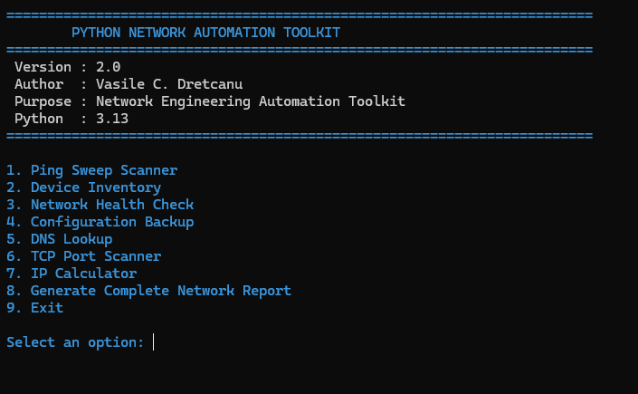
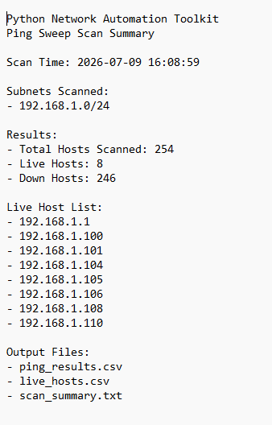
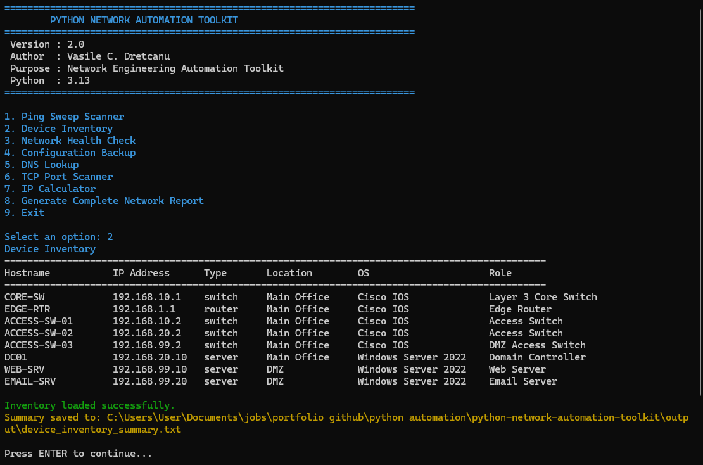
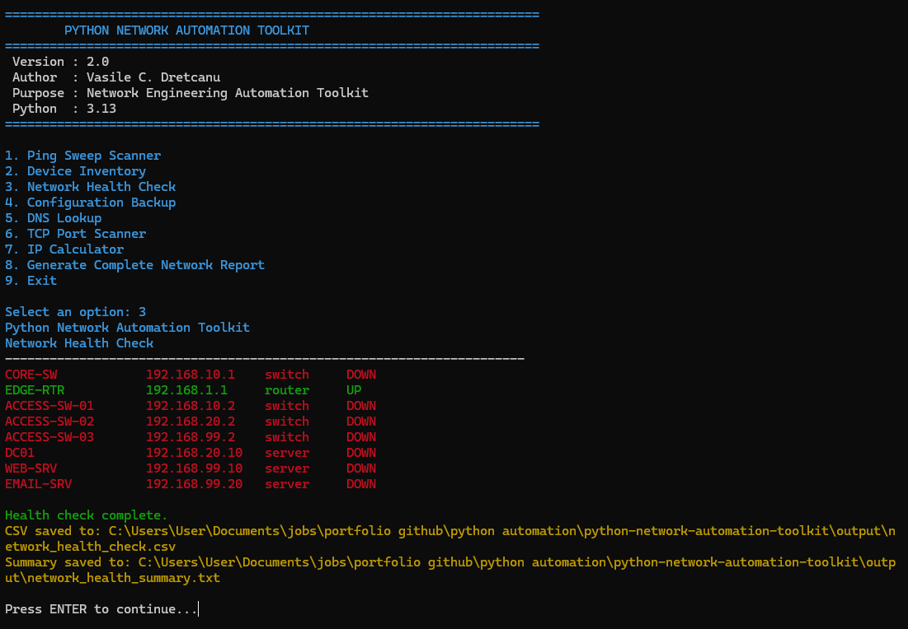
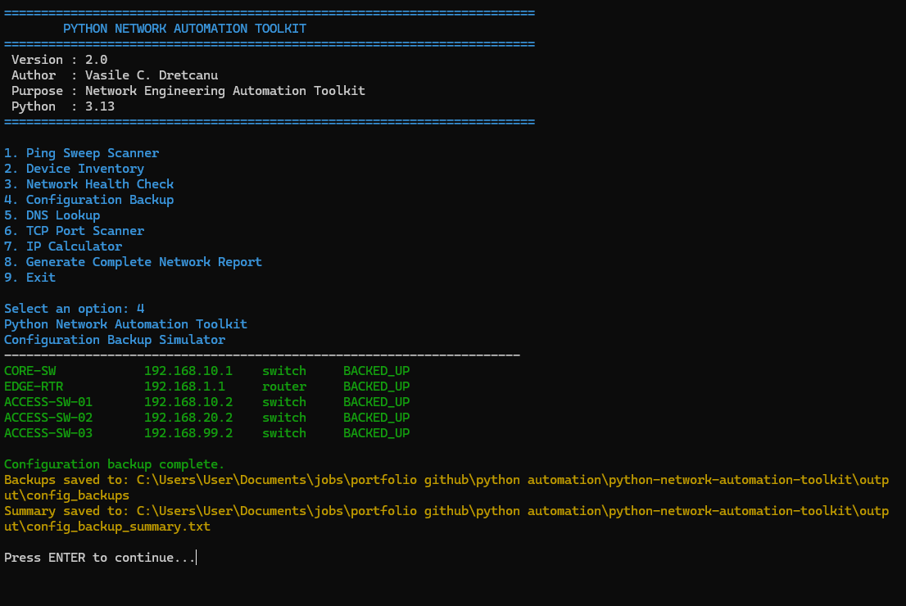
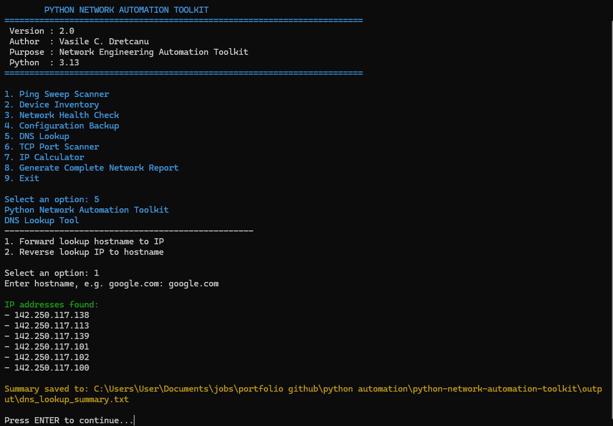
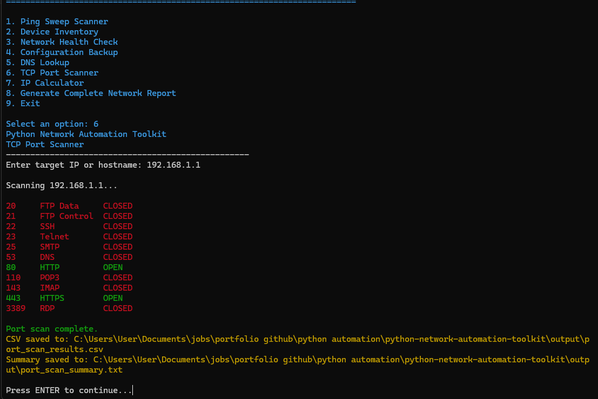
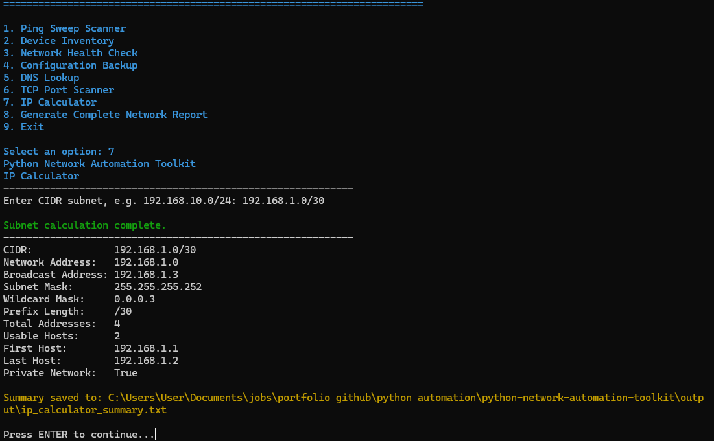
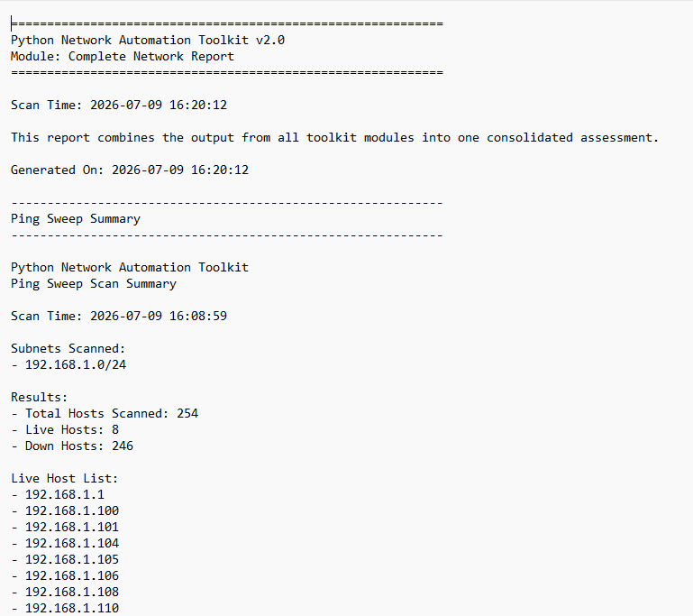

# 🐍 Network Automation Toolkit

> **Built with Python**\
> A professional command-line toolkit for automating common Network
> Engineering and Infrastructure tasks.


------------------------------------------------------------------------

## 📸 Application Preview



## 🚀 Project Highlights

-   ✅ 8 integrated networking modules
-   ✅ Menu-driven CLI application
-   ✅ Modular Python architecture
-   ✅ Automated report generation
-   ✅ CSV and TXT exports
-   ✅ Cross-platform support

------------------------------------------------------------------------

## ✨ Features

  Module                    Description
  ------------------------- ------------------------------------
  Ping Sweep Scanner        Discover live hosts on a subnet
  Device Inventory          Manage a CSV inventory of devices
  Network Health Check      Verify device availability
  Configuration Backup      Simulate router and switch backups
  DNS Lookup                Forward and reverse DNS queries
  TCP Port Scanner          Scan common TCP ports
  IP Calculator             Calculate IPv4 subnet information
  Complete Network Report   Combine all reports into one

------------------------------------------------------------------------

## 📷 Screenshots

### Main Menu


### Core Modules

  -------------------------------------------------------------------------------
  Ping Sweep                           Device Inventory
  ------------------------------------ ------------------------------------------
     

  -------------------------------------------------------------------------------

  ------------------------------------------------------------------------------------------
  Health Check                                   Configuration Backup
  ---------------------------------------------- -------------------------------------------
     

  ------------------------------------------------------------------------------------------

  -------------------------------------------------------------------------------
  DNS Lookup                           TCP Port Scanner
  ------------------------------------ ------------------------------------------
     

  -------------------------------------------------------------------------------

### IP Calculator



### Complete Network Report



------------------------------------------------------------------------

## 🏗 Architecture

``` text
main.py
 ├── Ping Sweep Scanner
 ├── Device Inventory
 ├── Network Health Check
 ├── Configuration Backup
 ├── DNS Lookup
 ├── TCP Port Scanner
 ├── IP Calculator
 └── Complete Network Report
```

------------------------------------------------------------------------

## ⚡ Quick Start

``` bash
git clone https://github.com/dretcanu/python-network-automation-toolkit.git
cd python-network-automation-toolkit
python -m venv .venv
pip install -r requirements.txt
python main.py
```

------------------------------------------------------------------------

## 📁 Repository Structure

``` text
python-network-automation-toolkit/
├── main.py
├── banner.py
├── README.md
├── requirements.txt
├── scripts/
├── data/
├── docs/
├── output/
└── screenshots/
```

------------------------------------------------------------------------

## 🛠 Technologies

-   Python 3.13
-   socket
-   ipaddress
-   pathlib
-   csv
-   subprocess
-   concurrent.futures
-   colorama

------------------------------------------------------------------------

## 💼 Skills Demonstrated

**Networking**

-   IPv4 Addressing
-   CIDR Subnetting
-   DNS
-   TCP/IP
-   Port Scanning
-   Network Monitoring

**Python**

-   Modular programming
-   CLI development
-   CSV processing
-   File handling
-   Report generation
-   Exception handling

------------------------------------------------------------------------

## 🚀 Future Roadmap

-   SSH automation with Netmiko
-   SNMP monitoring
-   REST API integration
-   HTML reports
-   SQLite inventory
-   Logging improvements

------------------------------------------------------------------------

## 👨‍💻 About the Author

**Vasile C. Dretcanu**

Aspiring Network & Infrastructure Engineer building practical networking
and automation projects.

GitHub: https://github.com/dretcanu

------------------------------------------------------------------------

## 📄 License

Released under the MIT License.
